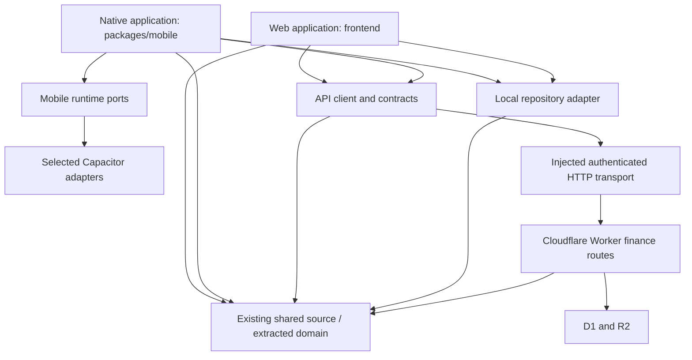

# Native architecture proposal

Status: recommended plan, awaiting the decisions register and phase approval. This document adds no application package, dependency, endpoint, migration or release workflow. Research baseline: Token Circles `fef628e6918eb1d80938c48c9c6eba2463ae642a`, inspected 2026-09-13. Source details and reference revision pins are in the [product audit](research/product-audit.md) and [reference architecture audit](research/reference-architecture.md).

## Architecture decision

Build a dedicated SolidJS/TypeScript/Vite application in `packages/mobile`, packaged by Capacitor for iOS and Android. Keep `frontend/` as the existing web application and `worker/` as the sole Cloudflare API backed by D1 and R2. Share contracts, finance rules and carefully extracted data access; author mobile navigation, views, styling and interaction independently. Capacitor renders this application in a platform WebView with native capability bridges. It does not turn Solid components into UIKit or Android Views. The acceptance standard is a native-quality experience with platform behavior, not an unsupported claim about the rendering technology.

Beside Cue provides the strongest independent application/composition precedent. MercuryPitch provides useful capability ports and sign-in integration, but its current mobile entry still imports the web `App`. Chaos Master PR 94 wraps an app build. Neither presentation shortcut is the target for Token Circles. The reference audit separates their actual implementations from historical plans.

## Proposed repository structure

```text
frontend/                         Existing web entry, shell, pages, browser adapters
worker/
  src/                            Existing Hono routes and server services
  migrations/                     Append-only D1 migrations, added in approved phases
shared/                           Existing pure shared source; retain initially
packages/
  pwa-kit/                        Existing browser service-worker/install package
  mobile/
    src/
      app/                        Native composition, providers, navigation, lifecycle
      features/                   Mobile screens and feature presentation
      components/                 Mobile controls, sheets, empty/error states
      styles/                     Mobile tokens and themes
      assets/                     Approved art, icons and launch assets
    capacitor.config.ts
    ios/                          Generated, reviewed and committed native project
    android/                      Generated, reviewed and committed native project
    tests/                        Navigation, interaction and platform smoke coverage
  api-client/                     Created when the first real shared transport is extracted
    src/contracts/                Validated DTOs and domain-facing resource contracts
    src/client/                   Request construction, parsing and typed failures
  mobile-runtime/                 Created with the first native capability integration
    src/ports/                    Narrow, platform-neutral capability interfaces
    src/web/                      Explicit preview/unsupported implementations
    src/capacitor/                Separately imported native adapters
    src/testing/                  Deterministic fakes, no real native side effects
  domain/                         Created only for an approved extraction with consumers
    src/                          Selected pure rules, models and calculations
docs/native/                      Product, design, decisions, implementation plans
```

Do not create empty catch-all packages to make the diagram look complete. A domain package earns its existence when code moves once, imports are updated, and web/native or Worker consumers exercise the same implementation. Keep existing `shared/` imports until that happens. Do not move `worker/` into the root workspace or replace its separate dependency lock as a scaffolding side effect. Current `pnpm-workspace.yaml` already includes `packages/*`.

The module boundaries, rather than these provisional internal filenames, are the important commitments:



Arrows mean allowed dependency/use. Domain imports neither application nor runtime, DOM, Capacitor, storage singleton or Worker environment. The Worker must not acquire native dependencies through shared exports. The local repository adapter's eventual package is intentionally undecided: first prove a second consumer and the selected database. Runtime adapters must be imported through narrow entry points so a haptics consumer does not load purchases, preferences and social sign-in transitively.

## Stack and platform decisions

Retain the repository's Solid 1.9, Vite 8, Zod 4 and TypeScript ecosystem unless a native integration proves a concrete compatibility requirement. Propose Capacitor 8, with a single compatible major across CLI, core, platforms and plugins. Pin exact reviewed versions in the lockfile during the approved scaffold phase; do not describe today's reference plugin pin as the version available indefinitely.

The researched Capacitor 8 toolchain uses Node 22+, Xcode 26+, Android Studio Otter 2025.2.1+, and a baseline of iOS 15 / Android API 24; its migration guide specifies Android compile/target 36. These are framework baselines, not an approved Token Circles support policy or a perpetual store submission rule. Reference CI uses Java 21. Revalidate at implementation against the selected releases and store submission requirements. [Capacitor 8 migration guide](https://capacitorjs.com/docs/updating/8-0)

Recommended compatibility decision to evaluate: iOS 16+ and Android API 29+, subject to the owner approving reach and the selected credential-store, auth, file and purchase plugins passing on those floors. This is a proposal, not a requirement inferred from Capacitor. Compare iOS 15/API 24 support in the same capability spike before fixing the floor. Do not inherit Chaos Master's much higher GPU-driven floors. Swift Package Manager versus CocoaPods is also an explicit plugin compatibility decision; Capacitor 8 defaults do not certify every third-party plugin.

Use `@capgo/capacitor-social-login` as the first Google/Apple integration candidate because MercuryPitch has exercised it. Its audited version is 8.5.7. Keep the plugin behind an auth-provider adapter; the Worker validates provider proof and issues Token Circles sessions. Native purchases, secure credentials, file selection/capture, background work and notifications each need their own approved capability choice. Installing a package does not prove it is registered or usable on both native platforms.

## Extraction plan mapped to current source

| Order / gate                                         | Existing source                                                                                                                                                      | Proposed work                                                                                                                                        | Evidence to complete before advancing                                                                                                                                       |
| ---------------------------------------------------- | -------------------------------------------------------------------------------------------------------------------------------------------------------------------- | ---------------------------------------------------------------------------------------------------------------------------------------------------- | --------------------------------------------------------------------------------------------------------------------------------------------------------------------------- |
| Scaffold, after design and architecture approval     | Root workspace and `frontend/package.json`; no existing mobile package                                                                                               | Add independent `packages/mobile` build and platform projects; fixtures and mobile design primitives only                                            | iOS simulator and Android emulator cold launch a packaged local bundle; no desktop `App`, remote shell or PWA service worker imported; preview and release config separated |
| First finance slice                                  | `shared/transactionInvariant.ts`, `frontend/src/types/models.ts`, `frontend/src/schemas/models.ts`, `frontend/src/core/decimalInput.ts`                              | Share selected pure money/transaction contracts and parsing. Add `domain` only if it clarifies real imports                                          | Web and mobile pass identical fixtures for positive magnitude plus type, transfer endpoints, dates and decimal rules; production API shape unchanged                        |
| Shared transport                                     | `frontend/src/core/api.ts`, `frontend/src/core/apiFetch.ts`, `frontend/src/core/apiProfileScope.ts`, direct fetches in `frontend/src/core/storage/storageFactory.ts` | Introduce `api-client` with injected origin, auth, transport, profile scope and invalidation callbacks; migrate one resource end-to-end first        | Existing browser cookie requests remain valid; native request sends the approved credential; typed errors and profile-switch races tested; remaining bypasses inventoried   |
| Local workspace                                      | `frontend/src/types/storage.ts`, `frontend/src/core/storage/idb.ts`, `localApiRouter.ts`, `handlers/`                                                                | Extract repository/use-case seams while preserving local validation, database schema and backup format. Select native storage after durability spike | Existing IndexedDB upgrade fixtures and backup round trips pass; app kill/restart, low disk, OS upgrade and export/import tested on the chosen native database              |
| Accounts/transactions/budgets and subsequent screens | Relevant mobile feature alongside existing `frontend/src/features/` and `worker/src/routes/`                                                                         | Use the shared contracts; implement each native screen with its full loading, empty, error, permission and destructive-action states                 | Approved screen/state parity inventory; correct writes under profile changes; web regression tests for touched shared behavior                                              |
| Imports and reports                                  | `shared/bankImport/`, `shared/importCsv.ts`, `shared/importMapping.ts`, `frontend/src/core/storage/clientPdfReports.ts`                                              | Share parsing and report data; isolate document acquisition, DOM/canvas rendering and save/share adapters                                            | Bank fixture parity, review-before-import, cancellation and large-file tests; receipt completeness visible in backup results                                                |
| Projections and insight                              | `shared/retirement.ts`, `shared/retirementSettings.ts`, `frontend/src/core/achievements/`, `frontend/src/features/subscriptionDetection.ts`                          | Extract deterministic calculations; inject currency preferences into `core/currency.ts`; split `subscriptionBrands.tsx` data from SVG UI             | Representative date/currency fixtures agree across clients; SVG/DOM imports absent from pure entry points                                                                   |
| Release readiness                                    | `.github/workflows/ci.yml` and existing deployment workflows                                                                                                         | Add scoped native checks and explicit signed-release workflows after release configuration approval                                                  | Complete security/billing/device gates; existing dev/prod deployment triggers preserved; secrets fail closed for releases                                                   |

All paths above are repository-relative. Their current behavior and line-level evidence are documented in the [product audit](research/product-audit.md#reusable-logic-and-boundaries). Extraction is not permission to rewrite stable modules wholesale. Keep desktop `appStore`, hash navigation, global modal flags, mounted hidden page trees, chart presentation and page CSS within `frontend/`.

## Data modes and platform persistence

V1 recommendation for approval: offer an independent local workspace and online managed-cloud mode; preserve drafts and clearly marked stale reads in cloud mode. Treat arbitrary self-hosted Worker support as an explicit V1 inclusion decision. Fully offline cloud editing needs a separate outbox/conflict project and is not implied by any database selection.

Today the local database is IndexedDB `finance-manager`, schema version 12; local and server modes switch through a one-time export/import helper. A browser's data does not automatically appear in the installed app. Provide deliberate, verified backup transfer for existing local users. Do not rename the browser database, remove its migrations, or silently associate local data with a newly authenticated account.

Evaluate native IndexedDB durability and native SQLite against real data volume, migrations, receipts, backup compatibility, recovery and plugin maintenance before selecting persistence. A local data repository and a small secure credential store are different facilities. Capacitor Preferences is appropriate for non-secret settings, not receipt datasets or a credential vault; its documented implementations are UserDefaults and SharedPreferences. OS cleanup and uninstall behavior also need truthful recovery copy. [Capacitor Preferences](https://capacitorjs.com/docs/apis/preferences)

Every repository/resource key carries environment/server identity, user or local-workspace identity and profile scope. Capture the profile ID at the beginning of a command; do not recompute it from a global selection while an entry sheet is open. Discard late responses for an older scope. A household read remains aggregation of one account's profiles; it cannot imply invitations or permissions that do not exist.

## Composition, lifecycle and navigation

Create services at the mobile entry: selected data mode, repository/client, session controller, entitlement reader and capability adapters. Feature views receive explicit services or app-owned contexts; they do not import a desktop singleton. Runtime capability results distinguish supported, unavailable, denied, cancelled and failed. Fake adapters support desktop design preview without claiming that a camera, biometric prompt or purchase actually occurred.

Own the mobile tab/stack/sheet router. A tab can retain its useful list position without permanently mounting every visited chart and page. A single lifecycle service translates Capacitor app foreground/background events into session refresh, visible-resource revalidation and secure-content masking. Browser preview may adapt document visibility to that same service; do not run two independently scheduled refresh loops. Cancel obsolete network work when scope changes, pause visual timers when backgrounded, and tear down event listeners on disposal.

Handle Android Back, iOS back gesture, interrupted entry, keyboard insets, safe areas, orientation, text scaling and tablet split views as behavior, not CSS decoration. Preserve drafts on interruption and expose whether they were saved locally or submitted. Deep links are parsed into an allowlisted route model, validated and queued through cold-start initialization; authentication callbacks are consumed only by the matching auth ceremony. Apple Universal Links and Android App Links require verified website associations. [Capacitor deep links](https://capacitorjs.com/docs/guides/deep-links)

## Authentication and finance transport boundary

The [authentication plan](authentication.md) is a prerequisite to connecting real accounts. Current web HttpOnly cookies stay intact. Native credential exchange and renewal are additive; ordinary Worker authorization validates the approved native credential before entering the same owned-profile routes. Personal API/MCP tokens are not repurposed.

Run a focused native-HTTP-versus-WebView-fetch spike before implementing the production adapter. Prove origin handling, redirects, cookie isolation, TLS failure, file upload/download, cancellation and error classification on both OS families. Default to an injected transport rather than globally patching `fetch`. A native network stack is not a reason to relax server authorization; a WebView origin allowlist is not a substitute for it. The approved solution must keep existing cookie CORS behavior separate from native bearer traffic.

Keep finance errors typed: validation, unauthenticated, step-up required, forbidden profile, entitlement required, conflict, rate-limited, offline, unavailable and invalid response. The current client dispatches browser events and can log raw validation payloads; replace those dependencies at the seam with explicit callbacks and redacted diagnostics. Never replay a possibly completed financial write just because its response was lost. Offline mutation replay and idempotency are separately specified work.

## Files, billing and other capabilities

Native receipt capture must normalize an accepted encoding or surface an unsupported file state: today's Worker accepts JPEG, PNG, GIF, WebP and PDF, not HEIC. Respect existing 5/25/50 MB plan limits. Manage temporary files, cancellation and permission changes. Do not silently reduce a document's legibility to make it fit. Imports accept supported CSV/XLSX and existing bank rules; receipts are not an OCR product.

Keep billing as a server-authoritative capability consumed by UI. The subscription plan determines Apple/Play integration and any purchase SDK. A purchase success screen waits for verified entitlement or explains its pending state. Account/profile identity is bound before purchases; local financial data and store identity are never guessed into an account. Source-aware manage/restore/deletion behavior and existing Stripe duplicate-subscription safeguards must survive. This document does not approve a payment model.

Camera/files are plausible V1 capabilities. Biometrics, local reminders, push, widgets, share extensions and background synchronization remain separate scope decisions. A biometric privacy lock does not provide database encryption or replace server authentication.

## Build, CI and release boundaries

Native builds package local Vite assets. No production `server.url`, development cleartext exception or desktop PWA update controller may enter signed builds. Keep app identifiers, URL associations, permission usage strings, privacy manifests and platform icons under review; identifiers and minimum OS versions require a recorded decision before platform generation.

Add native package typecheck/unit/UI checks without weakening existing frontend and real Worker-isolate checks. Root `pnpm typecheck` currently does not include Worker typecheck, so the release checklist must name both. Changes to root lockfile, relevant shared source, native runtime, platform projects and native config must trigger appropriate native compilation. Match native registration to installed plugin versions and run `cap sync` as a reviewed build step, not an assumption.

Use thin app-specific CI callers with explicit secrets and reusable build jobs where useful. Signed release jobs must fail clearly on missing signing/service configuration. Optional unsigned scaffold checks may skip signing, but cannot report an upload as successful. Keep monotonically increasing Android version codes and iOS build numbers across workflow renames. Define a separate native release trigger, proposed `mobile-v*`; ordinary `v*` tags deploy this repository's web production. Audit wildcard matching before enabling either trigger. Scaffolding does not authorize production deployment, store upload or publication.

## Approval and acceptance gates

- [ ] Approve architecture and the mobile navigation/design direction before generating native projects.
- [ ] Decide V1 data modes, feature coverage, app identifiers, OS floors and tablet support.
- [ ] Approve credential/session policy, provider coverage, passkey fallback, self-host trust model and proof required from the native transport/storage spikes.
- [ ] Approve each extraction when its real consumers and regression fixtures are identified.
- [ ] Approve each functional slice against phone/tablet states and existing data invariants before advancing.
- [ ] Approve purchase model and entitlement migration before any purchase implementation.
- [ ] Approve release configuration and distribution action separately after complete device, security, billing and accessibility evidence.

No duration estimates or calendar commitments are implied. The owner records an answer in the master decisions register; completion of a preceding phase does not itself approve the next one.
